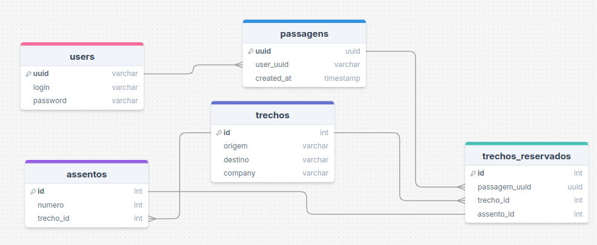
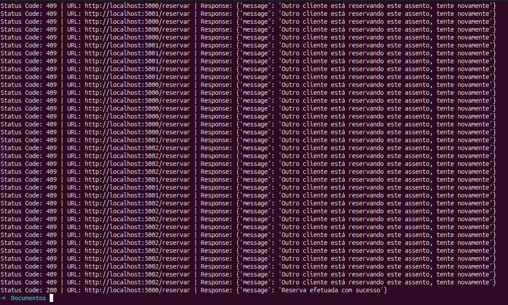

<div align="center">
  <h1> PASSCOM - Venda de Passagens </h1>
  <h3>Universidade Estadual de Feira de Santana</h3>
  <h3> TEC502 - MI Concorrência e Conectividade</h3>
  <h4>Letícia Teixeira Ribeiro dos Santos, Lucca de Almeida Hora Coutinho</h4>
</div>

## Introdução

<p align="justify">
	O sucesso da Vendepass, um sistema de compra de passagens de tráfego aéreo para companhias aéreas de baixo custo (LCCs) chamou a atenção de outras três empresas brasileiras. Visando a otimização de recursos, essas três empresas se uniram para ter uma oferta conjunta de assentos. O PassCom é derivado dessa junção, sendo um sistema de venda compartilhada de passagens aéreas. 
</p>

<p align="justify">
	No PassCom, cada companhia mantém seu próprio servidor Vendepass. Os clientes realizam as compras nas rotas oferecidas por cada companhia, e os servidores, que fazem parte de um sistema distribuído, comunicam-se entre si para a troca de informações.
</p>

<p align="justify">
	Este relatório descreve os recursos utilizados, bem como seus resultados para a criação do PassCom. As próximas seções detalham passo a passo as funcionalidades do sistema.
</p>

## Metodologia e Resultados

<p align="justify">
O projeto foi criado com uma arquitetura baseada em contêineres, utilizando Docker e Docker Compose para administrar diversos serviços de forma eficaz. A implementação do backend foi feita com Flask, encarregado da API RESTful e da lógica de negócios. O PostgreSQL atuou como um banco de dados relacional, auxiliado pelo Prisma ORM para simplificar operações de consulta e manipulação de dados, além de gerenciar migrações de esquema.
</p>

<p align="justify">
Para aprimorar o desempenho, o Redis foi incorporado como um cache distribuído, estabelecendo bloqueios distribuídos. A interface do usuário foi desenvolvida com React, proporcionando uma interface dinâmica e responsiva, interagindo com o backend através da API. É importante ressaltar que a linguagem de programação utilizada foi Python, usando o VSCode como editor de código-fonte. Além disso, o Docker Compose conduziu a integração de todos os serviços, assegurando um ambiente de desenvolvimento estável e de fácil utilização.
</p>

<p align="justify">
Ainda nesta seção, além dos recursos usados para a construção do sistema, são descritos os resultados de cada funcionalidade e requisito do PassCom.
</p>

### Arquitetura da Solução

<p align="justify">
	A arquitetura do sistema é baseada no cliente-servidor, porém contendo uma comunicação entre servidores. Resumidamente, é como se quando um servidor for comunicar com outro, o remetente da mensagem é como um cliente. Além disso, há semelhanças com o modelo de arquitetura Three-Tier. Existem três camadas no PassCom, a de aplicação (com o front-end), a camada de lógica de negócios (com o back-end) e a camada de banco de dados (com PostgreSQL). A diferença é que no Three-Tier o banco de dados geralmente é centralizado, enquanto neste projeto, cada servidor tem um banco de dados isolado. As seções posteriores descrevem essa particularidade e detalham os componentes da arquitetura.
</p>

<p align="justify">
Os componentes dessa arquitetura são: 
</p>

- **Cliente**: o usuário que interage com o sistema, mandando mensagens e recebendo dos servidores.
- **Servidores**: existem 3 servidores no PassCom, cada um representando uma companhia aérea de baixo custo.
- **Protocolo de comunicação**: utilizado com API REST.
- **Lógica de negócios**: feita no back-end, é o conjunto de regras, processos e tratamentos de erros que definem toda a parte funcional do sistema, como a compra de passagem, verificação de assento, entre outros.
- **Banco de dados**: há um banco de dados para a persistência de dados.
- **Interface de usuário**: [A inserir]
- **Semelhança com arquitetura de três camadas (Three-Tier)**: a arquitetura é semelhante à Three-Tier por dividir o sistema em camadas de apresentação, lógica de negócios e dados, mas difere por ter múltiplos bancos de dados isolados em contêineres, criando um ambiente distribuído.

<p align="center">
    
    <br/>
    <b>Figura 1.</b> Representação do modelo Three-Tier. <b>Fonte:</b> Internet.
</p>

#### Banco de Dados

<p align="justify">
	Foi escolhido o banco de dados relacional PostgreSQL para armazenar as informações do sistema. Cada servidor possui um banco de dados executando isoladamente em seu próprio container Docker. Devido aos requisitos do sistema, existem alguns dados que são compartilhados entre servidores como os usuários e as passagens, foi tomada essa decisão para que o usuário crie sua conta de acesso apenas uma vez, e possa acessar e consultar suas passagens através de qualquer servidor. 

</p>
<p align="justify">
	No esquema relacional, tanto a tabela de usuário como a de passagens possui um identificador único associado (UUID) que é o mesmo em todos os bancos de dados, facilitando a busca distribuída. 
	O fluxo de reserva funciona da seguinte forma:
</p>

1. Criação de uma passagem em todos os servidores relacionada ao uuid do usuário solicitante
2. Criação de trechos reservados a partir de cada um dos trechos escolhidos, associando também o assento respectivo. São criados no servidor de cada companhia que o trecho pertence
3. Os assentos são alterados para não disponiveis
4. Associação dos trechos reservados à passagem, facilitando o agrupamento na visualização das passagens


<p align="center">
    
    <br/>
    <b>Figura 2.</b> Esquema de relações do banco de dados. <b>Fonte:</b> O autor.
</p>

### Protocolo de Comunicação
<p align="justify">
    Toda a comunicação foi feita através de API REST, aceitando e enviando dados em formato JSON e seguindo princípios stateless, em que cada requisição recebe todos os dados necessários para ser processada. Os endpoints são protegidos com autenticação JWT, os usuários precisam estar logados para realizar as operações que são: visualizar trechos, comprar passagem, visualizar passagens e cancelar passagem.
    Foram implementados dois conjuntos de rotas: comunicação entre servidores e comunicação entre clientes e servidores, a documentação da API está detalhada posteriormente nesse artigo.
</p>


### Roteamento
<p align="justify">
[A inserir no código]
</p>


### Concorrência Distribuída
<p align="justify">
    A fim de evitar que ocorra acessos simultâneos aos dados compartilhados, foi utilizado o Redis para lock distribuído. Todos os servidores se conectam à mesma instância do Redis, quando um cliente solicita uma reserva e envia a requisição com todos os trechos em uma lista através da API, o Redis cria uma chave única contendo o id do trecho, numero do assento e nome da companhia para cada um dos registros da lista e faz o lock em todos, se outra requisição chegar e tentar o lock com a mesma chave, o Redis nega pois só pode haver chaves únicas.
</p>


<p align="justify">
 Em seguida, é feita a verificação de disponibilidade de assento em todos os trechos, se por acaso o assento não estiver disponível em algum, o lock é liberado. Caso passe 30 segundos e a reserva não seja feita, o lock também é liberado, evitando deadlocks. Por fim, é também liberado ao criar a reserva com sucesso.

</p>


### Confiabilidade da Solução
<p align="justify">
    Caso os servidores sejam desconectados e conectados novamente, os clientes não poderão continuar a operação que estavamfazendo e deve reiniciá-la ao se reconectar. Do ponto de vista da concorrência, o "lock" adquirido ao se solicitar a compra de uma passagem é liberado após 30 segundos em qualquer situação, para evitar que ocorram deadlocks. Além disso, a API foi desenvolvida seguindo o princípio Stateless, em que o estado do cliente não é armazenado entre requisições.
</p>


### Avaliação da Solução
<p align="justify">
	Testes foram realizados para avaliar o comportamento do sistema em caso de falha de um dos servidores. Observou-se que, quando todos os servidores não são estritamente necessários para uma operação, os servidores que permanecem ativos conseguem concluir suas tarefas normalmente, em conformidade com o requisito do sistema de que a falha de um servidor não deve impactar os demais. Portanto, ao tentar reservar uma passagem que inclui trechos de todos os três servidores, a operação não é concluída em nenhum deles, pois a disponibilidade de assento não pode ser verificada em todos os trechos necessários.
</p>
<p align="justify">
	As operações que podem ser concluídas individualmente incluem a visualização de trechos, a visualização de passagens compradas, o registro e o login. No entanto, caso um servidor fique fora do ar, os trechos específicos desse servidor não serão exibidos ao cliente, fazendo com que as informações pareçam incompletas. Esse problema é registrado como um log no terminal, indicando que houve falha em alguns dos servidores.
</p>

<p align="justify">
	Para viabilizar os testes foi criado um script de seed para os bancos de dados, em que cada servidor contém tanto dados específicos quanto compartilhados com os demais.
	A concorrência foi testada executando um script com 30 requests simultâneos em cada servidor, todos tentando comprar o mesmo assento no mesmo trecho, apenas um conseguiu efetuar a compra e o restante recebeu uma mensagem de conflito, indicando que outro cliente estava reservando o assento em questão. Abaixo, o resultado da execução do script no terminal:
</p>
<p align="center">
    
    <br/>
    <b>Figura 3.</b> Teste da concorrência com múltiplas respostas. <b>Fonte:</b> O autor.
</p>

### Documentação da API

#### Comunicação entre servidores
#### 1. Cadastro de cliente

**Requisição**
```
POST /register
Content-Type: application/json

{
    "login": "username1",
    "password": "password1"
}
```
**Resposta**
```
{
    "message": "Usuário criado com sucesso"
}
```

#### 2. Busca de trechos no servidor atual
**Requisição**
```
GET /trechos
```
**Resposta**
```
[
	{
		"assentos": [
			{
				"disponivel": 1,
				"id": 3,
				"numero": 2
			},
		],
		"company": "c",
		"destino": "Cidade D1",
		"id": 1,
		"origem": "Cidade C1"
	},
	{
		"assentos": [
			{
				"disponivel": 1,
				"id": 8,
				"numero": 4
			},
			{
				"disponivel": 1,
				"id": 10,
				"numero": 5
			}
		],
		"company": "c",
		"destino": "Cidade D2",
		"id": 2,
		"origem": "Cidade C2"
	}
]
```

#### 2. Cria trecho reservado, associa trecho, assento e passagem
**Requisição**
```
POST /trecho-reservado
Content-Type: application/json

{
	"id_trecho": 1,
	"id_assento": 3,
	"uuid_passagem": uuid-3
}
```
**Resposta**
```
{
	"message": "Trecho reservado"
}
```

#### 3. Deleta um ou mais trechos reservados ao solicitar cancelamento de passagem
**Requisição**
```
DELETE /trecho-reservado/<uuid-passagem>
```
**Resposta**
```
{
	"message": "Trecho cancelados com sucesso"
}
```

#### 3. Busca assento para verificar disponibilidade ou atualiza para disponível ou não disponível
**Requisição**
```
GET /assentos/<id>
PUT /assentos/<id>
Content-Type: application/json

{
	"disponivel": 1
}

```
**Resposta**
```
{
	"id": 1,
	"numero": 5,
	"id_trecho": 2,
	"disponivel": 1
}
```

#### 4. Cria uma passagem no servidor atual
**Requisição
```
POST /passagem
Content-Type: application/json

{
	"user_uuid": "uuid_user1"
	"uuid": "uuid_passagem1"
}
```
**Resposta**
```
{
	"message": "Passagem criada com sucesso"
}
```
#### 4. Busca passagens associadas a um usuário contendo trechos e assentos reservados
**Requisição**
```
GET /passagem/user/<user_uuid>
Content-Type: application/json
```

**Resposta**
```
[
	{
		"created_at": "Wed, 30 Oct 2024 20:22:37 GMT",
		"trechosReservados": [
			{
				"assento": {
					"disponivel": 0,
					"numero": 1
				},
				"trecho": {
					"company": "a",
					"destino": "Cidade B1",
					"origem": "Cidade A1"
				}
			},
			{
				"assento": {
					"disponivel": 0,
					"numero": 1
				},
				"trecho": {
					"company": "b",
					"destino": "Cidade C1",
					"origem": "Cidade B1"
				}
			}
		],
		"uuid": "uuid-1"
	}
]
```
#### 5. Deleta passagem mediante solicitação de cancelamento
**Requisição**
```
DELETE /passagem/<user_uuid>/<passagem_uuid>
```

**Resposta**
```
{
	"message": "Passagem deletada com sucesso"
}
```

---

#### Comunicação entre clientes e servidores

#### 1. Cliente insere login e senha e recebe um token JWT para acessar o servidor atual. Todas as rotas do cliente necessitam do token.

**Requisição**
```
POST /login
Content-Type: application/json

{
    "login": "username1",
    "password": "password1"
}
```
**Resposta**
```
{
	"access_token": "eyJhbGciOi...iz9A"
}

```
#### 2. Cadastro do cliente em todos os servidores


**Requisição**

```
POST /register-all
Content-Type: application/json

{
    "login": "username1",
    "password": "password1"
}
```
**Resposta**
```
{
    "message": "Usuário criado com sucesso"
}
```
#### 3. Busca trechos em todos os servidores, contém os assentos disponíveis de cada trecho 

**Requisição**
```
GET /all-trechos
Authorization: Bearer Token

```
**Resposta**
```
[
	{
		"assentos": [
			{
				"disponivel": 1,
				"id": 3,
				"numero": 2
			},
			{
				"disponivel": 1,
				"id": 5,
				"numero": 3
			}
		],
		"company": "a",
		"destino": "Cidade B1",
		"id": 1,
		"origem": "Cidade A1"
	}
]
```
#### 3. Cria uma passagem com os trechos e assentos escolhidos em todos os servidores 
**Requisição**
```
POST /reservar
Content-Type: application/json
Authorization: Bearer Token

{
	"user_uuid": "uuid2",
    "trechos": [
        {
            "id_trecho": 1,
            "id_assento": 9,
            "company": "a"
        },
        {
            "id_trecho": 2,
            "id_assento": 9,
            "company": "b"
        },
        {
            "id_trecho": 1,
            "id_assento": 9,
            "company": "c"
        }
    ]
}
```
**Resposta**
```
{
    "message": "Reserva efetuada com sucesso"
}
```

#### 4. Busca passagens do usuário através do seu UUID (identificador único)

**Requisição**
```
GET /passagens-all/<user_uuid>
Authorization: Bearer Token
```
**Resposta**
```
[
	{
		"created_at": "Wed, 30 Oct 2024 20:22:37 GMT",
		"trechosReservados": [
			{
				"assento": {
					"disponivel": 1,
					"numero": 2
				},
				"trecho": {
					"company": "c",
					"destino": "Cidade D1",
					"origem": "Cidade C1"
				}
			}
		],
		"uuid": "uuid-2"
	}
]
```

#### 5. Cancela passagem em todos os servidores através do UUID da passagem e do usuário
**Requisição**
```
DELETE /passagem-all/<user_uuid>/<passagem_uuid>
Authorization: Bearer Token
```
**Resposta**
```
{
    "message": "Passagem deletada com sucesso"
}
```


#### Códigos de Status 


| Código | Significado                       | Descrição e Ação Recomendada                                       |
|--------|-----------------------------------|--------------------------------------------------------------------|
| 200    | Sucesso                           | A requisição foi bem-sucedida |
| 400    | Requisição Inválida               | Dados enviados estão incorretos ou incompletos |
| 401    | Não Autorizado                    | Acesso não autorizado, token ou credenciais incorretas |
| 404    | Não Encontrado                    | O recurso solicitado não existe |
| 500    | Erro Interno do Servidor          | Falha no servidor, pode ter parado de executar ou outros erros|


### Emprego do Docker
<p align="justify">
    Devido a necessidade de ter vários containers com serviços diferentes executando, foi usado o Docker Compose para gerenciá-los. Ao todo são 7 containers: 3 para os servidores das companhias, em que é executado o código da API; 3 para os bancos de dados de cada companhia; e 1 para o Redis que gerencia a concorrência distribuída. Todos os containers fazem parte da mesma rede e usam o driver Bridge, que permite a comunicação entre eles.
</p>

<p align="justify">
    As dependências são instaladas através do Dockerfile e também foi implementado um script para executar ao subir os containers, que são as migrações do Prisma e execução do Flask.
</p>

## Conclusão

<p align="justify">
	O PassCom foi criado como um sistema básico de cliente-servidor, utilizando a API REST para estabelecer a comunicação e usando princípios stateless de servidor. Em prol disto, é possível realizar comunicação entre os servidores e clientes e servidores de forma eficaz. A utilização da API REST dá uma melhor performance e aumenta a confiabilidade do sistema, como também possibilita oportunidades de expansão em trabalhos futuros.
</p>

<p align="justify">
	O uso de um banco de dados PostgreSQL foi um recurso acrescido durante o desenvolvimento, que possibilitou o armazenamento de informações e consequentemente, uma testagem de concorrência mais fácil. Além disto, a implementação de práticas recomendadas de desenvolvimento, tais como autenticação, correção de erros e documentação da API, junto com a aplicação do Redis como sistema de _lock_ distribuído auxiliou na segurança do sistema.
</p>

<p align="justify">
	Em síntese, os requisitos e as funcionalidades do sistema PassCom foram atentidos com sucesso, como também os testes de concorrência. A experiência obtida durante o desenvolvimento e execução deste projeto servirá como um guia para futuros projetos, incluindo no âmbhito profissional, uma vez que as tecnologias usadas são bastantes presentes no mercado de trabalho.
</p>

